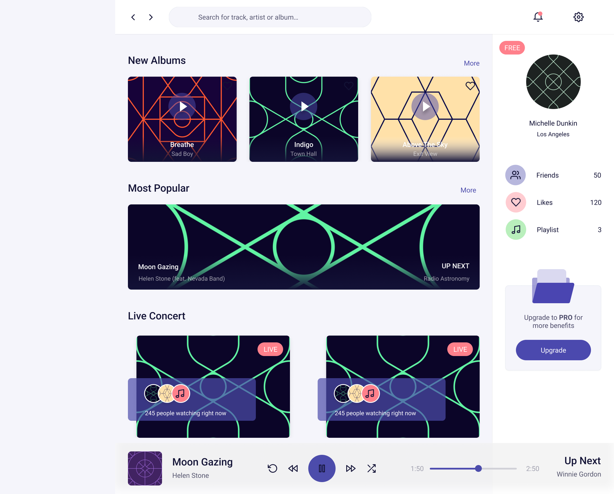
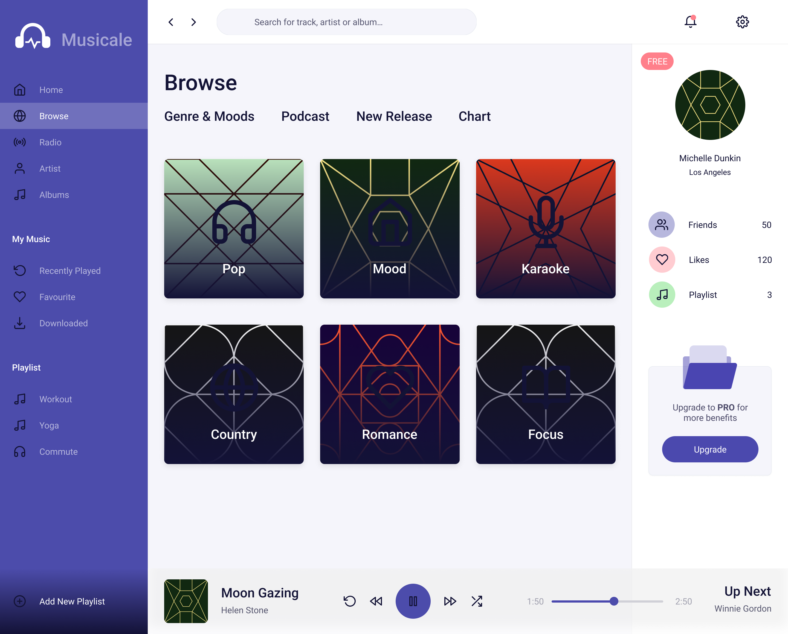
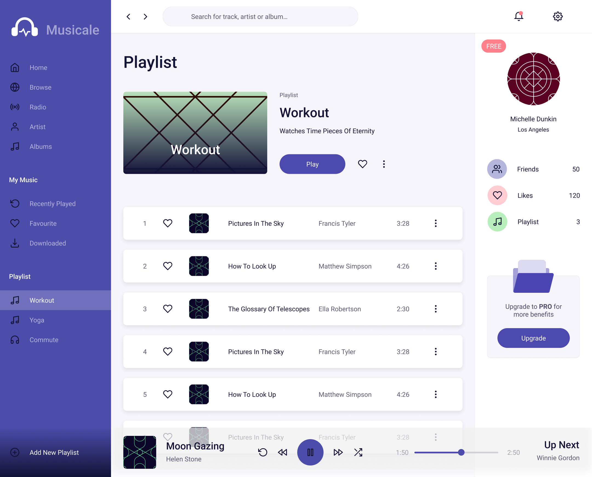
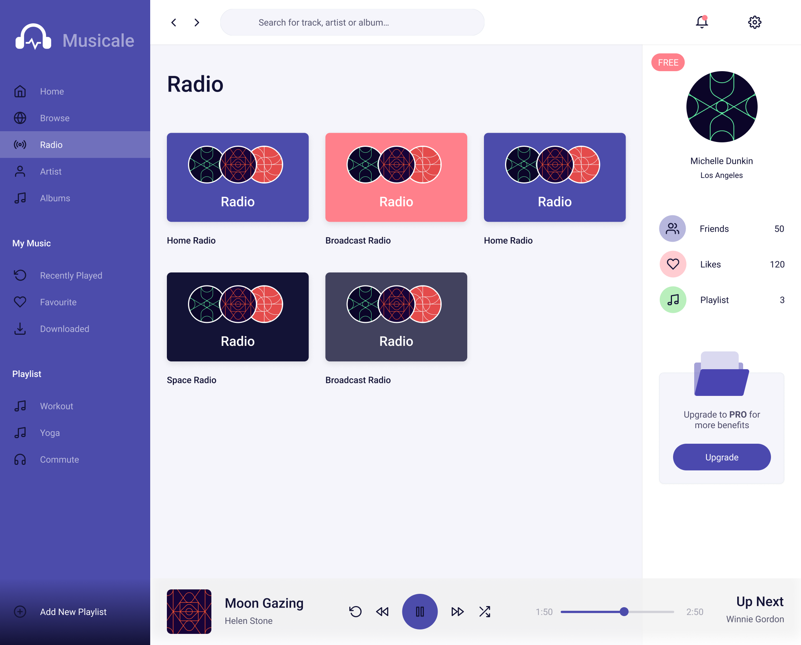

# Musicale - Music Streaming Dashboard

A modern music streaming dashboard built with React, Vite, and Tailwind CSS.

**Live Preview:** [https://music-app-dashboard-lac.vercel.app/](https://music-app-dashboard-lac.vercel.app/)

## Screenshots

### Login / Sign Up


### Dashboard



### Browse



### Playlist



### Radio



## Tech Stack

- **React 19** with TypeScript
- **Vite** for fast development and builds
- **Tailwind CSS 4** for styling
- **React Router** for client-side routing
- **TanStack Query** for data fetching
- **Zustand** for state management
- **React Hook Form** + **Zod** for form handling and validation
- **Sentry** for error monitoring

## Installation

Clone this repository. You will need Node.js and Yarn installed globally on your machine.

```bash
git clone <repository_url>
cd music_app_dashboard
yarn install
```

## Usage

**Start the dev server:**

```bash
yarn dev
```

**View in browser:**

```
http://localhost:3000
```

**Build for production:**

```bash
yarn build
```

## Environment Variables

Create a `.env` file in the project root with the following variables:

```env
VITE_BACKEND_BASE_URL=<your_backend_url>
VITE_ENV=development
VITE_SENTRY=<sentry_flag>
VITE_ENCRYPTED_KEY=<your_encryption_key>
```

Optional Sentry configuration:

```env
VITE_SENTRY_DSN=<your_sentry_dsn>
VITE_SENTRY_SAMPLE_RATE=0.5
VITE_SENTRY_REPLAYS_SESSION_SAMPLE_RATE=0.1
VITE_REPLAYS_ON_ERROR_SAMPLE_RATE=1.0
```

## Contributing

Contributions are welcome! Please follow these steps:

1. Clone the repository.
2. Create a new branch (`git checkout -b feature-branch`).
3. Make your changes.
4. Add your changes (`git add [add-respective-files-path]`).
5. Commit your changes (`git commit -m 'Add respective commit'`).
6. Push to the branch (`git push origin feature-branch`).
7. Open a pull request.

## Import Order Guidelines

When importing files in the project, follow this structure:

1. Built-in modules (e.g., `react`, `react-dom`) at the top.
2. External npm packages next.
3. Add a blank line after built-in and external imports.
4. Internal files should use the `#` alias.

```ts
// Built-in modules
import React from 'react';
import ReactDOM from 'react-dom/client';

// External npm packages
import lodash from 'lodash';

// Internal files
import Button from '#/components/Button';
import utils from '#/utils/helpers';
```
